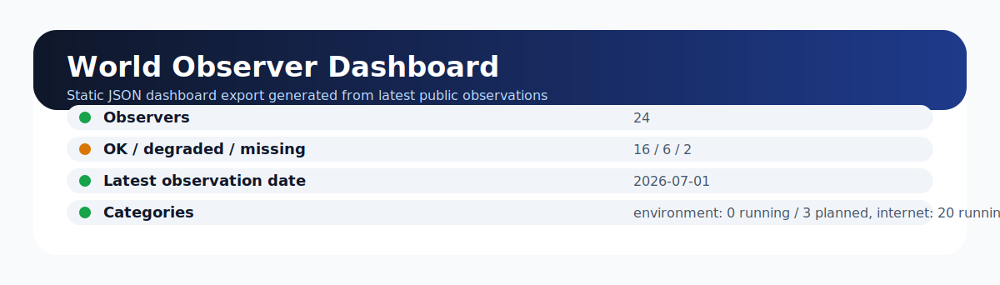
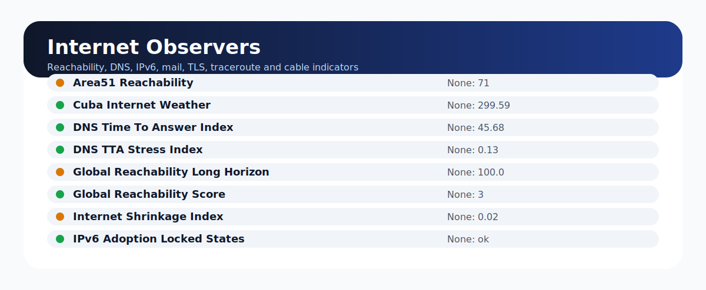
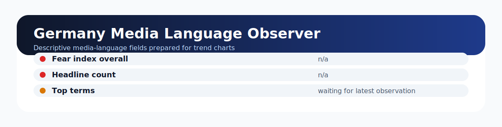
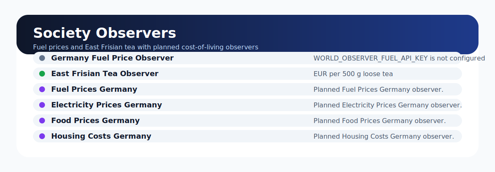

<div align="center">

# 🌍 World Observer

**An automated observational platform for long-term public indicators.**

[](LICENSE)


## 🌐 Live Dashboard

Explore the latest public observations published by World Observer:

[https://dennishilk.com/world-observer.html](https://dennishilk.com/world-observer.html)

</div>

---

World Observer records repeatable, long-running observations of public indicators and publishes them as small JSON archives and static-dashboard exports. It is built for durability: a stable observer pipeline, conservative public-data sources, historical state retention, and descriptive dashboards that can be maintained for years.

> **Observational only:** World Observer records what public sources reported at a point in time. It does **not** predict, speculate, attribute causes, track people, or profile users.

<p align="center">
  
</p>

## ✨ What it does

| Capability | Description |
| --- | --- |
| 🕒 Automated daily observations | Runs observer modules on a fixed daily UTC cadence and stores canonical outputs. |
| 🧩 Modular observer framework | Each observer is a self-contained Python module that emits one JSON object. |
| 🗃️ Historical archives | Daily archives under `data/daily/YYYY-MM-DD/` preserve time-indexed observations. |
| 📊 Interactive dashboard data | Compact dashboard exports in `dashboard/` power a static website without coupling to raw schemas. |
| 📈 Reusable trend charts | Internet and media history exports provide ready-to-chart time series. |
| 💓 Heartbeat monitoring | Minimal hourly heartbeat files indicate automation liveness only. |
| 🔓 Public data only | Observers use public, non-invasive signals and avoid private or user-level data. |
| 🌐 Static website friendly | The publishing helper copies exported JSON into a GitHub Pages-style website checkout. |

## 🧭 Project scope

World Observer is a descriptive archive, not an intelligence product. The platform is designed around these constraints:

- **Public sources only** — no private datasets, user tracking, fingerprinting, or account-level collection.
- **No surveillance** — observers describe aggregate public indicators, not individuals.
- **No prediction** — outputs describe historical and current observations rather than forecasting future events.
- **No speculation** — dashboards avoid causal claims and keep interpretation separate from measurement.
- **Historical preservation** — daily JSON outputs are retained so changes can be reviewed over time.
- **Stable semantics** — observer behavior should remain consistent so long-horizon comparisons stay meaningful.

For more detail, see [`ethics.md`](ethics.md), [`methodology.md`](methodology.md), and [`SIGNIFICANCE_MODEL.md`](SIGNIFICANCE_MODEL.md).

## 📸 Screenshots

### Overview

The dashboard export summarizes observer health, category counts, latest dates, and website-safe status fields.

<p align="center">
  
</p>

### Internet Observers

Internet observers cover reachability, DNS behavior, IPv6 adoption, mail exchange visibility, TLS changes, traceroute-style indicators, and cable-dependency metadata.

<p align="center">
  
</p>

### Germany Media Language Observer

The Germany media-language observer exports website-safe descriptive fields and historical trend points for public media-language monitoring.

<p align="center">
  
</p>

### Society Observers: Fuel and East Frisian Tea

Society observers track public cost-of-living style indicators, currently including German fuel-price infrastructure and an East Frisian tea retail-price series.

<p align="center">
  
</p>

## 🗂️ Current observer categories

### Running observers

| Category | Observers |
| --- | --- |
| 🌐 Internet | Area51 Reachability; HTTP Reachability Index; Cuba Internet Weather; DNS Time To Answer Index; DNS TTA Stress Index; Global Reachability Long Horizon; Global Reachability Score; Internet Shrinkage Index; IPv6 Adoption Locked States; IPv6 Global Compare; IPv6 Locked States; Iran DNS Behavior; MX Presence By Country; MX Presence Per Country; North Korea Connectivity; Silent Countries List; TLS Fingerprint Change; Traceroute To Nowhere; Undersea Cable Dependency; Undersea Cable Dependency Map |
| 📰 Media | Media Language Germany |
| 🏘️ Society | Germany Fuel Price Observer; East Frisian Tea Observer |
| 🌱 Environment | _No running environment observers yet_ |

### Planned observers

| Category | Planned observers |
| --- | --- |
| 🌐 Internet | ASN Visibility By Country |
| 🏘️ Society | Fuel Prices Germany, Electricity Prices Germany, Food Prices Germany, Housing Costs Germany, Deutsche Bahn Punctuality, Deutsche Post Reliability |
| 🌱 Environment | Weather Germany, Climate Germany, Natural Disasters Germany |

The canonical category metadata lives in [`config/observer_metadata.json`](config/observer_metadata.json). The canonical daily runner list lives in [`scripts/run_daily.py`](scripts/run_daily.py).

## 🏗️ Architecture

```text
Observer
  ↓
State / latest JSON
  ↓
Dashboard export
  ↓
Static website
```

### Pipeline responsibilities

| Layer | Responsibility | Main paths |
| --- | --- | --- |
| Observer | Collect one public observation and emit one JSON object on stdout. | `observers/*/observer.py` |
| Daily runner | Execute canonical observers, normalize outputs, write daily archives, and run the meta observer. | `scripts/run_daily.py`, `data/daily/`, `data/latest/` |
| State | Preserve observer-specific historical state needed for continuity. | `state/` |
| Dashboard export | Convert latest and daily raw observer outputs into compact, website-safe JSON. | `scripts/export_dashboard.py`, `dashboard/` |
| Static website publish | Copy exported dashboard JSON into a separate website checkout. | `scripts/publish_dashboard_to_pages.py` |
| Heartbeat | Publish liveness-only hourly heartbeat files. | `scripts/heartbeat_push.py`, `state/heartbeat/` |

## 📁 Repository structure

```text
world-observer/
├── observers/                 # Self-contained observer modules
├── data/
│   ├── daily/YYYY-MM-DD/       # Immutable daily JSON archives
│   └── latest/                 # Rolling latest observer snapshots
├── dashboard/                  # Static-website JSON export files
│   └── history/                # Compact trend-history exports
├── state/                      # Local observer state and heartbeat files
├── scripts/                    # Daily runner, exporter, publishing, health checks
├── visualizations/             # Significance visualization helpers
├── docs/                       # Operational and dashboard documentation
├── tests/                      # Pytest suite and fixtures
├── cron/                       # Example cron schedule
├── reports/                    # Operational reports and audits
├── ethics.md                   # Ethical scope and collection constraints
└── methodology.md              # Measurement methodology
```

Raw local capture directories are intentionally ignored where appropriate so the repository can retain durable aggregate archives without bloating Git history.

## 🚀 Running the project

### Requirements

- Python 3.12+
- Linux or another cron-capable Unix-like environment for long-running automation
- `pip` and a virtual environment

### Install locally

```sh
git clone https://github.com/dennishilk/world-observer.git
cd world-observer
python -m venv .venv
source .venv/bin/activate
python -m pip install --upgrade pip
python -m pip install -r requirements.txt -r requirements-dev.txt
```

### Run the daily observer pipeline

```sh
python scripts/run_daily.py --date 2026-07-01
```

This writes per-observer outputs to `data/daily/2026-07-01/`, refreshes `data/latest/`, and writes the meta summary as `summary.json` and `summary.md`.

### Export dashboard JSON

```sh
python scripts/export_dashboard.py
```

The exporter writes compact static-website files to `dashboard/`, including category summaries and history exports.

### Publish dashboard JSON to a local Pages checkout

```sh
python scripts/publish_dashboard_to_pages.py --pages-repo /path/to/dennishilk.github.io
```

The publish helper validates the target checkout and replaces only `world-observer/dashboard/` inside that website repository.

### Install automation on a server

```sh
sudo ./setup_world_observer.sh
```

The setup script installs idempotent cron jobs for:

- hourly heartbeat commits at minute `0`, and
- daily observer execution at **02:00 UTC**.

## 💓 Heartbeat semantics

Heartbeat commits are liveness indicators only. They are not observations, anomaly signals, daily summaries, or significance indicators.

```sh
cat state/heartbeat/2026-07-01T10Z.json
```

Only recent heartbeat files are retained, while observer archives remain under `data/daily/` and latest snapshots remain under `data/latest/`.

## 🧪 Development and checks

```sh
python -m pytest
python scripts/verify_repository_health.py
python scripts/export_dashboard.py
```

The test suite covers observer contracts, dashboard export behavior, metadata consistency, publishing safety, and selected observer parsers.

<details>
<summary><strong>Operational notes: cron, deploy keys, and data contracts</strong></summary>

### Daily directory contract

For a run date `YYYY-MM-DD`, `scripts/run_daily.py` treats `data/daily/YYYY-MM-DD/` as the canonical daily directory. Each observer listed in the runner emits one JSON object on stdout, the runner writes it to `data/daily/YYYY-MM-DD/<observer>.json`, and `world-observer-meta` reads that same directory through `WORLD_OBSERVER_DAILY_DIR`. The meta observer output is persisted as `summary.json` and rendered as `summary.md`; there is intentionally no `world-observer-meta.json` artifact.

### Meta observer success rules

`world-observer-meta` treats an observer as successful when its file exists, the JSON root is an object, and the top-level `status` is not `"error"`. Missing files, invalid JSON, non-object roots, and explicit error statuses are counted as missing/degraded.

### Cron and logs

The automation layer installs an hourly heartbeat and a daily 02:00 UTC observer run. Inspect repository-level cron output with:

```sh
tail -f ~/world-observer/logs/cron.log
```

For scheduler-level problems, check:

```sh
sudo systemctl status cron
crontab -l
```

### Deploy key setup

Long-running automation usually pushes with a dedicated GitHub deploy key:

```sh
ssh-keygen -t ed25519 -f ~/.ssh/id_ed25519_world_observer -C "world-observer-deploy-key"
ssh -o BatchMode=yes -T git@github.com
```

Add the public key to the repository deploy keys with write access, then configure the local checkout's SSH command as needed.

### Area 51 privacy constraint

The Area51 observer aggregates bounded airspace activity into daily activity units and rolling baselines. Tracked outputs intentionally do not contain callsigns, tail numbers, routes, or per-aircraft identifiers.

</details>

## 🛣️ Roadmap

World Observer is expanding from Internet-focused indicators into broader public-observation categories.

| Area | Planned work |
| --- | --- |
| ⚡ Electricity | Public electricity-price observer and chart-ready dashboard export. |
| 🍞 Food | Additional representative public food-price indicators. |
| 🏠 Housing | Descriptive public housing-cost indicators. |
| 🚆 Deutsche Bahn | Public punctuality/reliability observer. |
| 📮 Deutsche Post | Public postal-reliability observer. |
| 🌱 Environment | Weather, climate, and natural-disaster public-data observers. |
| 📊 Dashboard | Richer static website cards and reusable trend visualizations. |

## 🤝 Contributing principles

Contributions should preserve the project's observational scope:

1. Prefer public, stable, low-risk data sources.
2. Keep observers small, deterministic, and readable.
3. Emit one JSON object per observer run.
4. Separate collection from dashboard export and presentation.
5. Do not add user tracking, private data, invasive probing, or speculative claims.

## 📜 License

World Observer is released under the [MIT License](LICENSE).
